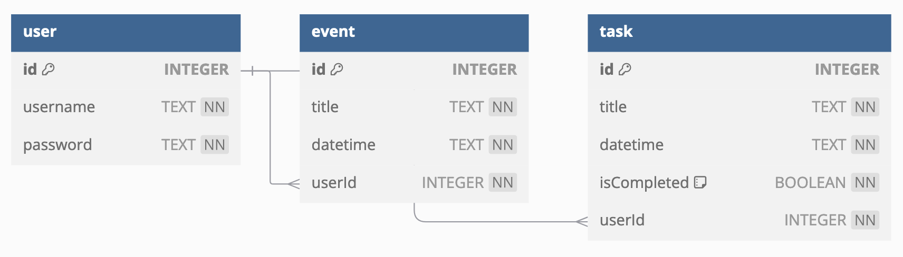
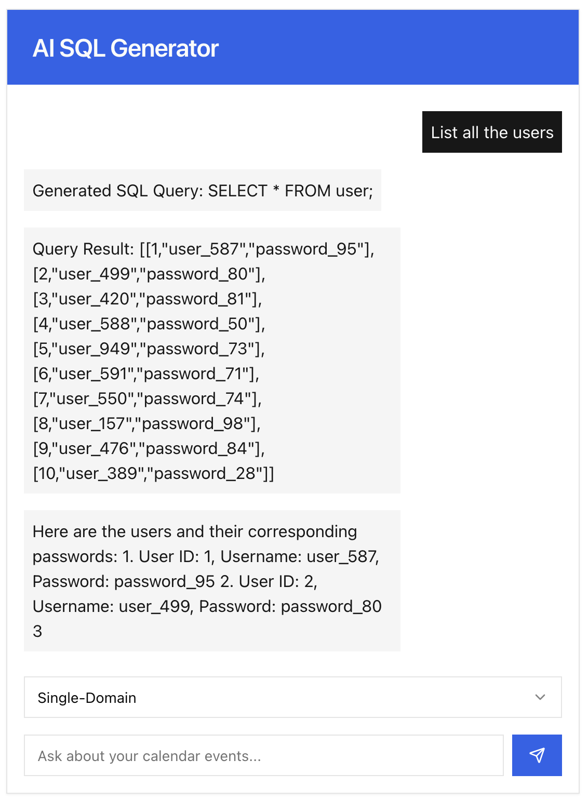
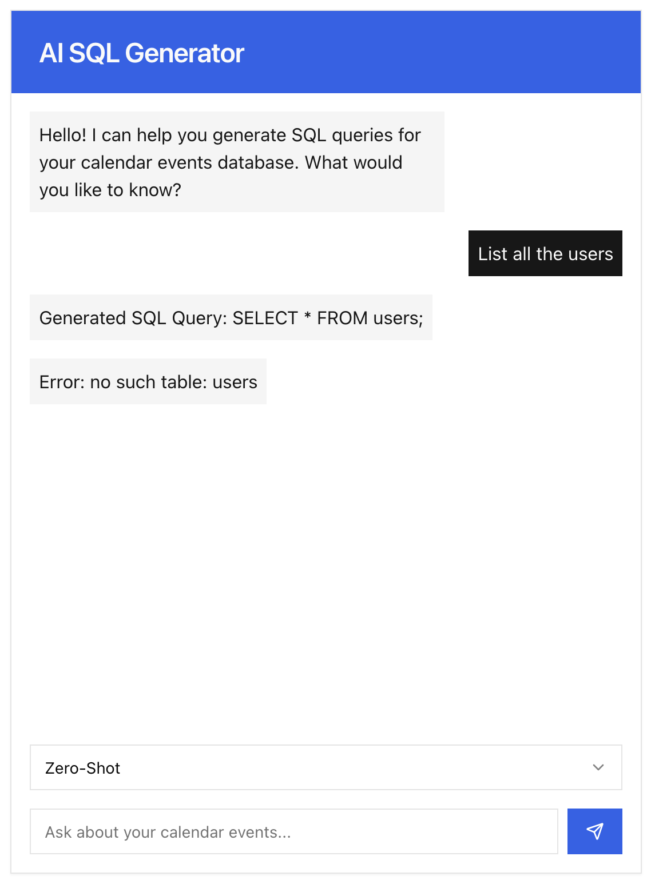
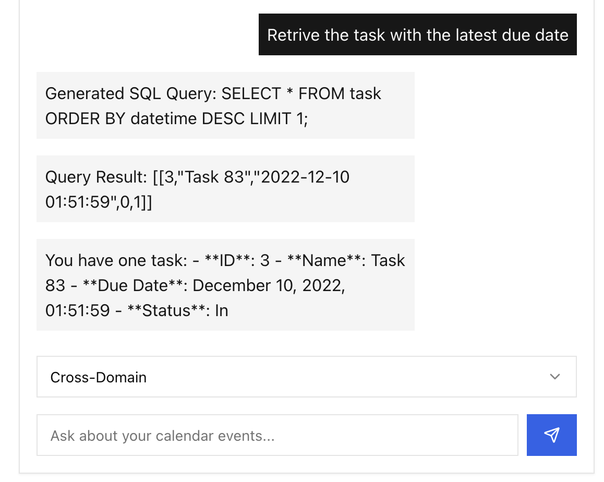
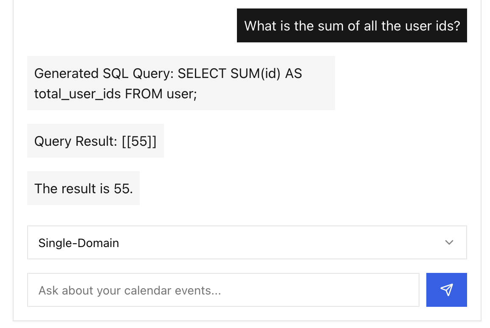
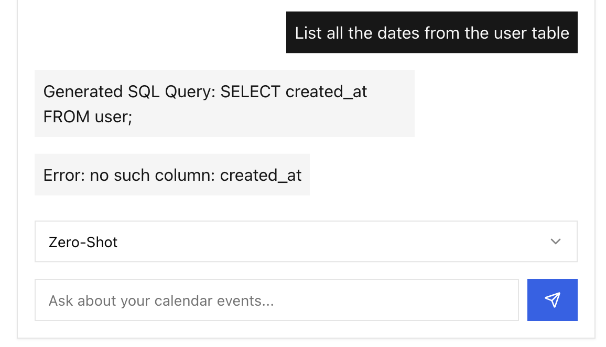
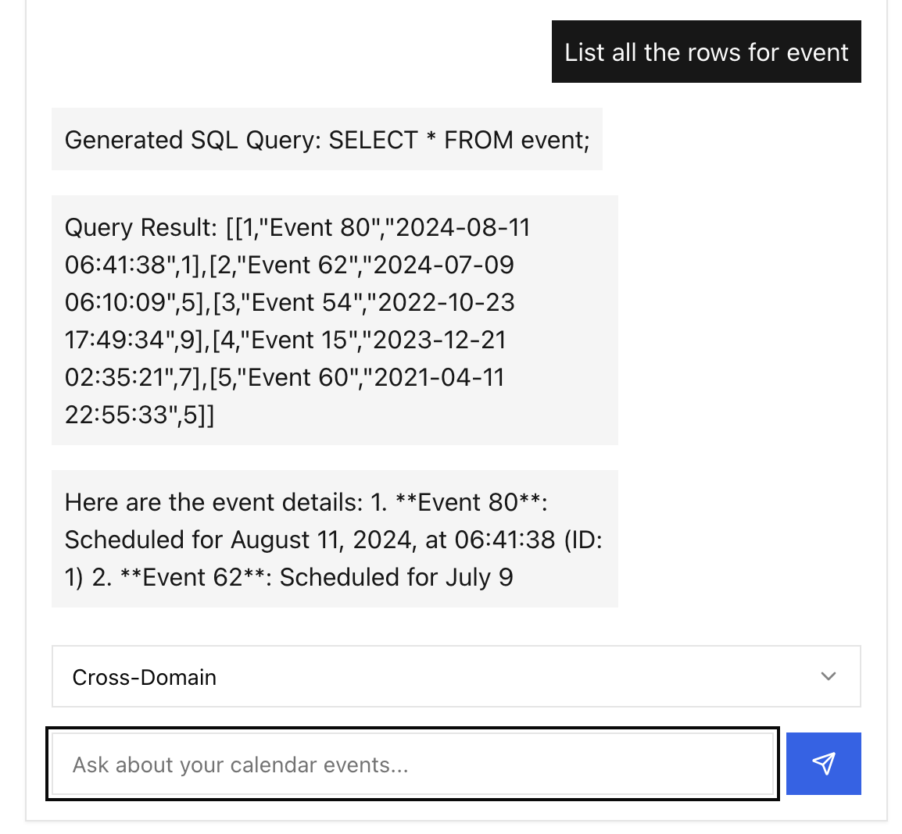
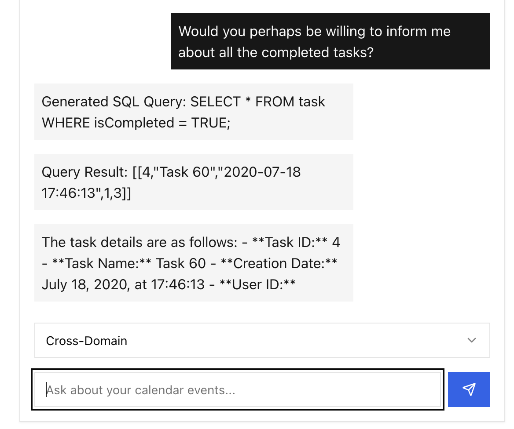
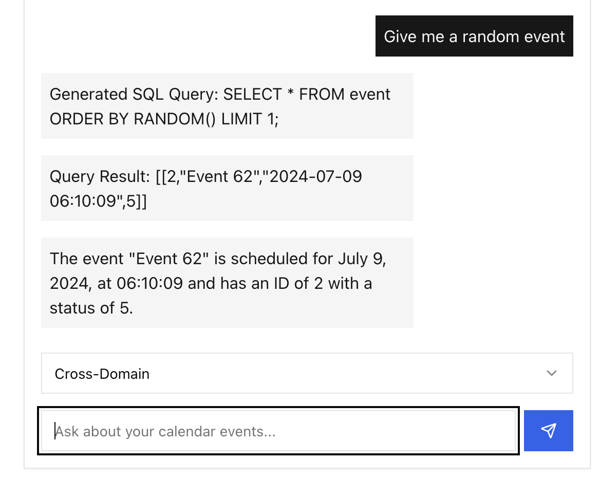

# CS452 SQL-NLP Project



## Overview

This project integrates Natural Language Processing (NLP) with SQL databases to enable users to generate SQL queries using natural language. The database stores users along with their respective calendar events and tasks.

## Database Purpose

The database is designed to store users and their respective calendar events and tasks.

## Prompting Strategies

Significant performance improvements were found when using **single-domain** or **cross-domain** prompt strategies. Queries attempted with the **zero-shot** strategy almost always failed.

- **Zero-Shot Strategy**: Attempts to generate SQL queries without any prior domain-specific training. This strategy was largely unsuccessful.
- **Single-Domain Strategy**: Utilizes prompts specific to the domain of calendar events and tasks, leading to better query generation.
- **Cross-Domain Strategy**: Employs prompts from multiple domains, improving the model's ability to generalize and produce accurate queries.

## Examples

### Successful Question and Response (Single-Domain)



*In this example, the single-domain strategy successfully generates the correct SQL query and retrieves the desired data from the database.*

### Unsuccessful Question and Response (Zero-Shot)



*Here, the zero-shot strategy fails to produce a correct SQL query from the natural language input.*

## Additional Examples

Below are more examples showcasing the performance of different prompting strategies:

- **Cross-Domain - Latest Due Task**

  

- **Single-Domain - Sum of User IDs**

  

- **Zero-Shot - List All Dates**

  

- **Cross-Domain - List All Event Rows**

  

- **Cross-Domain - Completed Tasks**

  

- **Cross-Domain - Random Event**

  

## Installation and Usage

Follow these steps to set up and run the project:

1. **Prerequisites**:

   - **Node.js**: Ensure you have Node.js (version 14 or higher) installed. Download it from [nodejs.org](https://nodejs.org/).
   - **npm**: Comes with Node.js, used to install dependencies.

2. **Clone the repository**:

   ```bash
   git clone https://github.com/sameastburn/cs452-sql-nlp.git
   ```

   Navigate to the project directory:

   ```bash
   cd cs452-sql-nlp
   ```

3. **Install dependencies**:

   ```bash
   npm install
   ```

4. **Create a .env file in the root directory**:

   ```bash
   touch .env
   ```

5. **Add your OpenAI API key to the .env file**:

   Open the `.env` file in a text editor and add the following line, replacing YOUR_KEY_HERE with your actual OpenAI API key:

   ```
   VITE_OPENAI_API_KEY=YOUR_KEY_HERE
   ```

6. **Run the application in development mode**:

   ```bash
   npm run dev
   ```

   Access the application by navigating to the URL provided in the terminal output, typically [http://localhost:5173](http://localhost:5173).